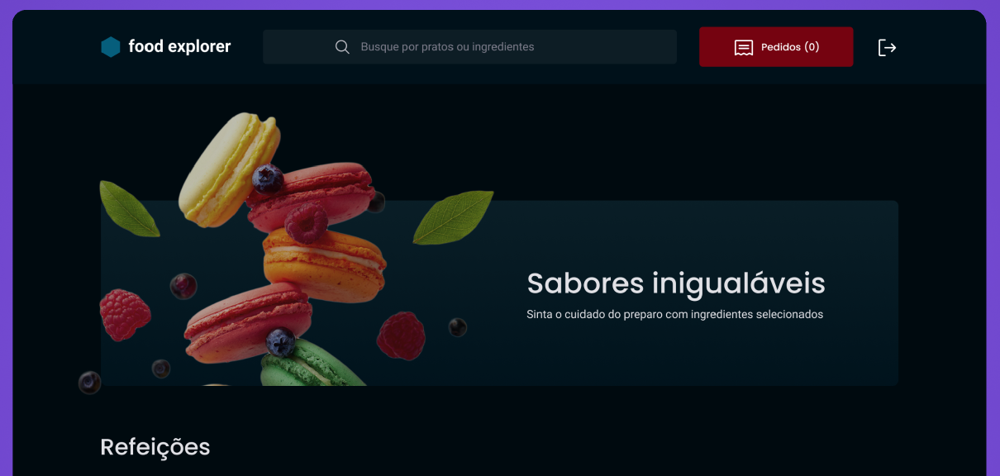

<h1 align="center"> Food Express Web 🍽️</h1>

  <a href="#-pages">Pages</a>&nbsp;&nbsp;&nbsp;|&nbsp;&nbsp;&nbsp;
  <a href="#-technologies">Technologies</a>&nbsp;&nbsp;&nbsp;|&nbsp;&nbsp;&nbsp;
  <a href="#-libraries">Libraries</a>&nbsp;&nbsp;&nbsp;|&nbsp;&nbsp;&nbsp;
  <a href="#-roles">Roles</a>&nbsp;&nbsp;&nbsp;|&nbsp;&nbsp;&nbsp;
  <a href="#-libraries">Deploy</a>&nbsp;&nbsp;&nbsp;

<h2 align="center"> About </h2>

  The Food Express API is the final project of the Rocketseat Explorer course. 
  The API aims to manage the requests from the web frontend with our database. 

<h2 align="center"> 📄 Pages </h2>

### Navigation (available on all pages)
- edit dish (admin), new (admin), favorites (customer), details, purchase history.
- Back to home.
- Log out.

### Home
- See all available dishes.
- Favorite a dish if customer, edit it if admin.
- Search for a specific dish by ingredient or name.

### New
- Create a new dish.

### Edit Dish
- Change dish information (ingredients, categories, others).

### Favorites
- See all favorite dishes.

### Purchase History
- See all purchases of that user or all purchases in the database if **admin**.

### Cart
- See dishes in the cart and proceed to payment flow.

## 🚀 Technologies

This project was developed using the following technologies:

- JavaScript
- React
- Vite
- HTML5
- CSS-IN-JS
- Git e Github
- Figma

  
## 📚 Libraries

This project was developed using the following libraries:

- axios
- styled-components
- react-router-dom
- react-icons
- react-dom

## 👤 Roles

1) Admin: home, details, editdishe, new, cart, purchasehistory.
2) Customer: home, details, favorites, cart, purchasehistory.

## ☁️ Deploy

[Food Explorer Web](https://food-explorer-web.vercel.app/)

=> You can try out the admin role by typing:
- email: admin@email.com
- password: 123

